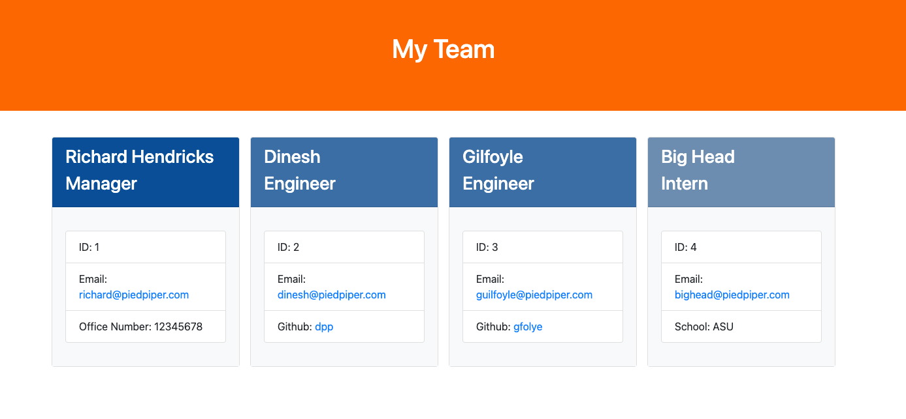
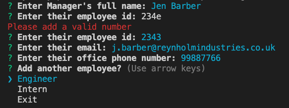

# Team Profile Generator

> A team profile builder using the command line.
> Demo [_here_](https://www.example.com).

## Table of Contents

- [General Info](#general-information)
- [Technologies Used](#technologies-used)
- [Features](#features)
- [Screenshots](#screenshots)
- [Setup](#setup)
- [Usage](#usage)
- [Contact](#contact)
- [License](#license)

## General Information

The Team Profile Generator creates a HTML webpage using the command line to enter details of your team. A simple page is created with each team member's details for quick reference.

## Technologies Used

- HTML5
- CSS3
- JavaScript
- Node.js
- [Jest v27.2](https://jestjs.io/)
- [Inquirer](https://www.npmjs.com/package/inquirer)
- [Boostrap v5.1](https://getbootstrap.com/docs/5.1/getting-started/introduction/)

## Features

- Ability to add 1 manager and multiple engineers and interns.
- Ability to add name, employee ID, and email for each team member.
- Add a phone number for manager, a linked github link for engineers and a school for intern.

## Screenshots

Page Example



Demo Example




## Setup

Using the command line, run the following from the root of the project:

```
npm install
```

## Usage

This project uses inquirer.js as the command line interface. To start building your team profile enter the following into the command line:

```
node index.js
```

Follow the prompts to first enter manager details and continue to add engineers and interns. When your team details have been entered, exit the application and your html page will be generated.

## Contact

Created by [@lilyso](https://github.com/lilyso/) - feel free to contact me!

## License

This project is open source and available under the [MIT License](https://opensource.org/licenses/MIT).
